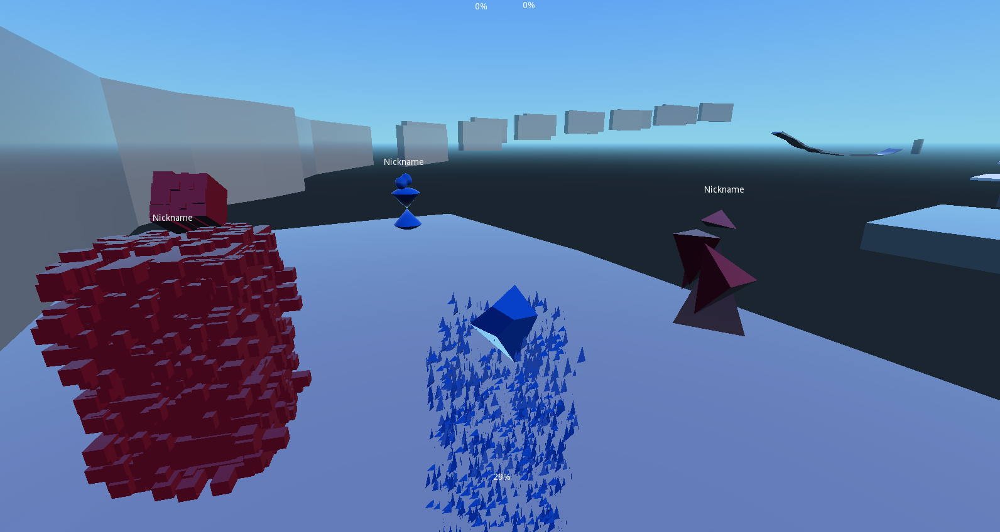

VANAGLORIA (working title)
==========================

> A team game with an emphasis on movement (with no shooting), inspired by Overwatch and Zineth

Main mechanics ideas:

- [x] Teams start side-by-side and must get to objective
- [x] Objective is a see-saw: have more mass on your side of point

Side mechanics ideas:

- [x] After enough movement, player can switch characters (switching is a mechanic, not a meta-game! no one-tricks)
- [x] Speed up slowly over time. Reset on switch

Current heroes:

- Active:
  - INDUSTRIA (Wallriding mfer)
- Offensive:
  - IRA (WallMAKING mfer)
  - LUSSURIA (An ATTRACTIVE mfer)
  - PAZIENZA (Slow down at a distance)
- Support:
  - CARITAS (Margarine)
  - SUPERBIA (Build portals)

Ideas for Heroes:

- More active
  - Blink (Tracer) - no cooldown, but loses all speed on hitting walls
  - Heavy guy - Slow, but very heavy for the see-saw
  - Climb and glide abilities
  - JUMPING
- More supportive
  - Boost - Area of effect or zarya-like cast, speeds people up
  - Flop - Changes side of see-saw for each team (should it be mechanic instead??)
  - Build - Build Zineth-like rails for anyone to use
  - (Combine with Ira?) Portal 2-like gels (bounce, speed, slow?)
  - (Combine with LUSSURIA?) Hook and swing on terrain
- More offensive
  - Lay traps
  - (Combine with PAZIENZA?) Destroy buildings

Key concepts:

- From mobas we take:
  - An emphasis on teamwork (Objective-based is a plus)
  - Rich, emergent interaction
  - Quick battles (very high replay value)
- From FPS we take:
  - Attention bursts / rationing
  - Fast pace
- From Zineth we take:
  - A rethinking of racing games
  - High skill cap, high(=easy) skill floor
  - Forgiving gameplay

Running
=======

First, install [godot engine (3.0)](https://godotengine.org/download). Then:

    $ git clone https://github.com/CosineGaming/nv-moba && cd nv-moba
    $ godot

Contributing
============

I'd love to have contributions!

Please open an issue first. As games are a creative project, I reserve the right to control the direction of the project.

Let me know if you have a better idea for a name :)

